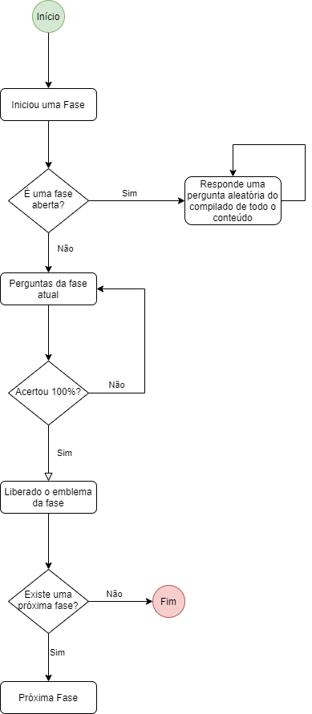

# GAME DESIGN DOCUMENT - GDD

## Seção 1 - Visão Geral do Jogo

### Título do Jogo
ETerface

## Seção 2 - Background e Fluxo do Jogo

### História do Jogo
Na Galáxia IHC-SS, a 17 anos luz de distância da Terra, existe o planeta Usabilicon (traduzido para o Português), que chega a ser um pouco menor que a Lua que é povoado por uma raça de alienígenas. Eles não são uma raça de grandes guerreiros, ou são super inteligente, ou têm um poderio bélico gigantesco, - diferente do que ocorre nos filmes - esses aliens são seres bem comuns, porém um pouco mais avançados, em relação aos avanços tecnológicos.

A característica que predomina entre os usabiliconianos é o gosto pelo estilo musical Zucrytz (traduzido para o Português) um estilo que se assemelha ao Eurobeat. 

No ano 12002 do planeta Usabilicon, os cientistas usabiliconianos  descobriram com sua nova tecnologia de satélites, que em cerca de 5 anos seu planeta seria engolido por um buraco negro. No mesmo ano sua nova tecnologia de satélites conseguiu detectar, por sorte, o planeta Terra.

Depois de 4 anos e 28 meses - em Usabilicon um ano te 30 meses - os usabiliconianos  conseguiram sair de seu planeta e foram para a Terra.

Agora disfarçados na Terra, usando um tecnologia de transmorficação do corpo, os usabiliconianos  precisavam ganhar a vida.

Dentre esses usabiliconianos está Nielsen (traduzido para o Português) especialista em engenharia de usabilidade de sistemas computacionais em Usabilicon, que agora precisa aprender os conceitos e princípios das interfaces terráques para poder conseguir um emprego e ganhar sua vida aqui na Terra.

### Fluxo do Jogo 
O jogo terá uma sequência de fases ao qual o usuário deverá seguir para que possa ser desbloqueado uma nova fase ao qual abordará um conteúdo mais avançado. Esse fluxo consistirá em 4 fases, os temas abordados em cada fase serão:
- Fase 1: Princípios de Usabilidade
- Fase 2: Heurísticas de Usabilidade de Nielsen
- Fase 3: Avaliação prática de Heurística de Usabilidade de Nielsen
- Fase Aberta: Compilado de todo o conteúdo.

Figura 1 - Fluxo de uma Fase

## Seção 3 - Gameplay

### Mecânica do Jogo
Ao iniciar uma fase será feita uma sequência de perguntas ao usuário, o usuário deverá responder essas questões. Cada fase terá X perguntas onde o usuário deverá acertar 100% das questões para concluí-la e liberar a próxima fase. Dentro da fase será fornecido dicas e explicações básicas sobre alguns termos abordados, como por exemplo uma explicação básica sobre cada tipo de heurística. Ao longo da fase o jogador irá receber recompensas de acordo com seu desempenho.

O jogo conta com uma segunda mecânica de jogo, que uma fase aberta. Nesta fase o jogador poderá responder sobre qualquer conteúdo que ele selecionar. Ele poderá responder quantas questões ele desejar. Esta fase não conta com a conquista de recompensas.

### Progressão do Jogo
#### Fases
Todas as fases do jogo abordarão um conhecimento diferente dentro da área de Usabilidade, indo do conceito mais inicial até a avaliação de interfaces feitas pelo usuário, cada questão poderá ter um formato diferente de respota, abaixo será descrito o que será abordado em cada fase e quais são os formatos de respostas esperados pelo usuário.

##### Fase 1
- **Tema:** Princípios de Usabilidade
- **Tipos de respostas:** Verdadeiro ou Falso; Múltipla Escolha (A,B,C,D);

##### Fase 2
- **Tema:** Heurísticas de Usabilidade de Nielsen
- **Tipos de respostas:** Verdadeiro ou Falso; Múltipla Escolha (A,B,C,D);

##### Fase 3
- **Tema:** Avaliação de Heurística de Usabilidade de Nielsen
- **Tipos de respostas:** Verdadeiro ou Falso; Múltipla Escolha (A,B,C,D); Tarefa de inspeção de interface identificando qual a violação de usabilidade e o local;

##### Fase Aberta
- **Tema:** Todo o Conteúdo das Fases Anteriores
- **Tipos de respostas:** Verdadeiro ou Falso; Múltipla Escolha (A,B,C,D); Identificar problemas de usabilidade em uma interface;

## Seção 4 - Elementos do Jogo

### Personagem 
Engenheiro de Software Alien chamado Nielsen, também chamado pelos amigos mais íntimos em Usabilicon por Nielsenlito (tradução em Português)

### Recompensas

- Recompensa 1: Acertando minha 1ª Questão
- Recompensa 2: Acertar 5 Questões seguidas sem errar
- Recompensa 3: Concluir a Fase 1
- Recompensa 4: Concluir a Fase 2
- Recompensa 5: Concluir a Fase 3
- Recompensa 6: Mestre das Interfaces, acertar todas as questões sem errar na fase 3
- Recompensa 7: Mestre das Heurísticas, acertar todas as questões sem errar na fase 2
- Recompensa 8: Mestre da Usabilidade, acertar todas as questões sem errar na fase 1
- Recompensa 9: Mestre Engenheiro, acertar todas as questões sem errar em todas as fases

## Sessão 5 - Parâmetros e requisitos do sistema

### Plataforma:
Plataforma Web

## Seção 6 - Criatividade e melhorias especiais no conceito de jogo

### Storyboard

Figura 2 - Storyboard Persona 1 - Nicoly

Figura 3 - Storyboard Persona 2 - Carlos

Figura 4 - Storyboard Persona 3 Felipe

### Esboço do jogo

    
    

## Referências
- Storyboard. Disponível em: <https://www.storyboardthat.com>. Acesso em 04 out. 2020.

## Histórico de Revisão

| Data | Versão| Descrição | Fase | Autor |
|----|----|----|----|----|
| 14/09/2020 | 1 | Adicionando aspectos gerais do jogo, história, elementos do jogo e storyboard | Análise de Requisitos | Mateus Sousa |
| 14/09/2020 | 1.1 | Atualização nos tópicos : fluxo do jogo, mecânica do jogo e fases | Análise de Requisitos | Rossicler |
| 16/09/2020 | 1.2 | Adicionado a coluna de fase no histórico de revisão | Análise de Requisitos | Rossicler |
| 16/09/2020 | 1.2.1 | Atualização do tópico "Fases" | Análise de Requisitos | Mateus Sousa |
| 05/10/2020 | 1.3.1 | Atualização do tópico "Fluxos do jogo" e "Storyboard" | Análise de Requisitos | Rossicler |
| 22/10/2020 | 1.4 | Adição de novos Storyboards | Design, Desenvolvimento e Avaliação | Mateus Sousa |
| 09/11/2020 | 1.5 | Alteração do fluxo do jogo | Design, Desenvolvimento e Avaliação | Mateus Sousa |
| 23/11/2020 | 1.5 | Adicionando Recompensas e refatorando gameplay | Design, Desenvolvimento e Avaliação | Mateus Sousa |
