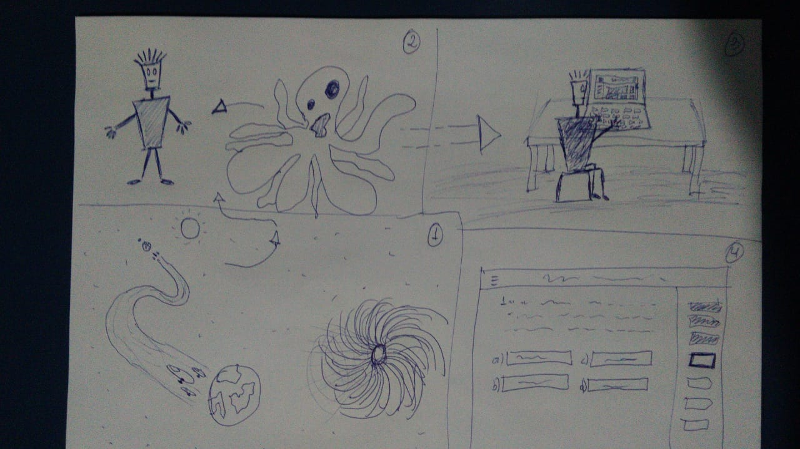

# GAME DESIGN DOCUMENT - GDD

## Sessão 1 - Visão Geral do Jogo

### Título do Jogo
ETerface

## Sessão 2 - Background e Fluxo do Jogo

### História do Jogo
Na Galáxia IHC-SS, a 17 anos luz de distância da Terra, existe o planeta Usabilicon (traduzido para o Português), que chega a ser um pouco menor que a Lua que é povoado por uma raça de alienígenas. Eles não são uma raça de grandes guerreiros, ou são super inteligente, ou têm um poderio bélico gigantesco, - diferente do que ocorre nos filmes - esses aliens são seres bem comuns, porém um pouco mais avançados, em relação aos avanços tecnológicos.

A característica que predomina entre os usabiliconianos é o gosto pelo estilo musical Zucrytz (traduzido para o Português) um estilo que se assemelha ao Eurobeat. 

No ano 12002 do planeta Usabilicon, os cientistas usabiliconianos  descobriram com sua nova tecnologia de satélites, que em cerca de 5 anos seu planeta seria engolido por um buraco negro. No mesmo ano sua nova tecnologia de satélites conseguiu detectar, por sorte, o planeta Terra.

Depois de 4 anos e 28 meses - em Usabilicon um ano te 30 meses - os usabiliconianos  conseguiram sair de seu planeta e foram para a Terra.

Agora disfarçados na Terra, usando um tecnologia de transmorficação do corpo, os usabiliconianos  precisavam ganhar a vida.

Dentre esses usabiliconianos está Nielsen (traduzido para o Português) especialista em engenharia de usabilidade de sistemas computacionais em Usabilicon, que agora precisa aprender os conceitos e princípios das interfaces terráques para poder conseguir um emprego e ganhar sua vida aqui na Terra.

### Fluxo do Jogo 
O jogo terá uma sequência de fases ao qual o usuário deverá seguir para que possa ser desbloqueado uma nova fase ao qual abordará um conteúdo mais avançado. Esse fluxo consistirá em 4 fases, os temas abordados em cada fase serão:
- Fase 1 Princípios de Usabilidade
- Fase 2 Heurísticas de Usabilidade de Nielsen
- Fase 3 Avaliação prática de Heurística de Usabilidade de Nielsen
- Fase 4 Compilado de todo o conteúdo.

## Sessão 3 - Gameplay

Perguntas e respostas
- Questão: Princípio de Usabilidade -> Resposta: Explicação
- Questão: Explicação ou descrição de um problema -> Resposta: Princípio de Usabilidade
- Avaliar interface respondendo qual o problema
- Avaliar interface apontando o problema (estilo jogo dos 7 erros)

### Mecânica do Jogo
Ao iniciar uma fase será feita uma sequência de perguntas ao usuário, o usuário deverá responder essas questões. Cada fase terá X perguntas onde o usuário deverá ter acerto em pelo menos 70% das X questões. Dentro de cada fase o usuário terá a possibilidade de pedir dicas, onde será limitado N dicas por fase. Também será fornecido um botão de ajuda onde ao clicar o usuário terá acesso a diversos links e referências sobre o tema discutido na fase, assim podendo estudar mais sobre o tema abordado.

Dentro da fase também será fornecido explicações básicas sobre alguns termos abordados, como por exemplo uma explicação básica sobre cada tipo de heurística.

O jogador após ter respondido 70% das perguntas corretamente terá de realizar um teste, onde ele terá I minutos para responder X questões, sem o auxilio de dicas. Caso ele consiga 70% de acerto no teste ele irá para a próxima fase.

### Progressão do Jogo
#### Fases
Todas as fases do jogo abordará um conhecimento diferente dentro da área de Usabilidade, indo do conceito mais inicial até a avaliação de interfaces feitas pelo usuário, cada poderá ter um formato diferente de respota, abaixo será descrito o que será abordado em cada fase e quais são os formatos de respostas esperados pelo usuário.
##### Fase 1
- **Tema:** Princípios de Usabilidade
- **Tipos de respostas:** Verdadeiro ou Falso; Múltipla Escolha (A,B,C,D);
##### Fase 2
- **Tema:** Heurísticas de Usabilidade de Nielsen
- **Tipos de respostas:** Verdadeiro ou Falso; Múltipla Escolha (A,B,C,D);
##### Fase 3
- **Tema:** Avaliação prática de Heurísticas de Usabilidade de Nielsen
- **Tipos de respostas:** Verdadeiro ou Falso; Múltipla Escolha (A,B,C,D); Identificar problemas de usabilidade em uma interface;

## Sessão 4 - Elementos do Jogo

### Personagem 
Engenheiro de Software Alien chamado Nielsen, também chamado pelos amigos mais íntimos em Usabilicon por Nielsenlito (tradução em Português)

## Sessão 5 - Controles I/O e Interface GUI
...

## Sessão 6 - Recursos Visuais e de Áudio
...

## Sessão 7 - Parâmetros e requisitos do sistema

### Plataforma:
Plataforma Web

## Sessão 8 - Criatividade e melhorias especiais no conceito de jogo

### Storyboard 

     
    Storyboard 1   
     
    Storyboard 2

## Histórico de Revisão

| Data | Versão| Descrição | Autor |
|----|----|----|----|
| 14/09/2020 | 1 | Adicionando aspectos gerais do jogo, história, elementos do jogo e storyboard | Mateus Sousa |
| 14/09/2020 | 1.1 | Atualização nos tópicos : fluxo do jogo, mecânica do jogo e fases | Rossicler |
