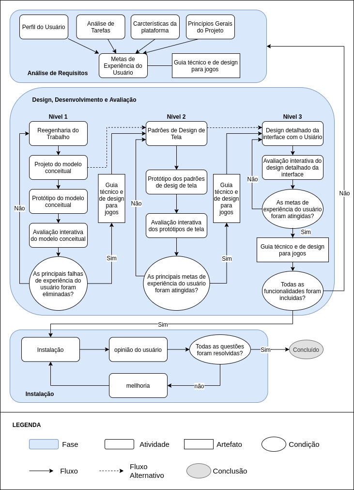

# Ciclo de Vida do Projeto

Neste projeto foi usado o ciclo de vida de engenharia de usabilidade proposto por Deborah Mayhew (1999), adaptado para o desenvolvimento de design de jogos.

Na fase de Análise requisitos a atividade de identificação de um perfil de usuário foi substituido pela técnica de persona. Segundo Cooper (1999) a aplicação da técnica de persona para a criação de design de interface é mais adaptável ao usuário em si do que as técnicas tradicionais de identificar o perfil do usuário.

Outro ponto que foi adaptado na fase de Análise de Requisitos foi a definição das metas de usabilidade, que além dos aspectos de usabilidade o design do jogo irá focar em atender  metas de experiência do usuário (UX). Essa mudança se baseia no Processo de Design Playcentric, onde a abordagem se contrentra em cada um de suas fases na UX. As metas de usabilidade e de experiência do jogador se baseiam no modelo MEEGA+, desenvolvido especificamente para jogos educacionais.

Ainda na Análise de Requisitos foi substituído o guia de estilo pela documentação específica para design de jogos, será criado então um esboço do Technical Design Document (TDD) e uma versão inicial do Game Design Document (GDD).

Essas mudanças impactaram outras atividades dentro da fase de Design. Desenvolvimento e Avaliação. Onde o elemento a ser avaliado é a UX e os artefatos atualizado e que guiam o processo são o GDD e o TDD. 

## Histórico de Revisão

| Data | Versão| Descrição | Autor |
|----|----|----|----|
| 07/09/2020 | 1 | Adicionando Ciclo de Vida do Projeto | Mateus Sousa |
| 07/09/2020 | 1.1 | Corrigido alguns problemas de escrita | Rossicler Júnior |
| 14/09/2020 | 1.2 | Mateus Augusto | Mateus Augusto |
| 16/09/2020 | 1.3 | Editado a especificação do GDD e TDD | Rossicler Júnior |

## Referências

- BARBOSA, S. D. J.; SILVA, B. S. DA. Interação Humano-Computador.
- COOPER, A. et al. About face 3: the essentials of interaction design. [3rd ed.], Completely rev. & updated ed. Indianapolis, IN: Wiley Pub, 2007. 
- Game Design Workshop-A playcentric approach to creating innovative games-2nd Edition. 
- PETRI, G.; WANGENHEIM, C. G. VON. A Method for the Evaluation of the Quality of Games for Computing Education. Anais dos Workshops do VIII Congresso Brasileiro de Informática na Educação (CBIE 2019). Anais... In: VIII CONGRESSO BRASILEIRO DE INFORMÁTICA NA EDUCAÇÃO. Brasília, Distrito Federal, Brasil: Brazilian Computer Society (Sociedade Brasileira de Computação - SBC), 21 nov. 2019Disponível em: <https://br-ie.org/pub/index.php/wcbie/article/view/9045>. Acesso em: 15 ago. 2020

